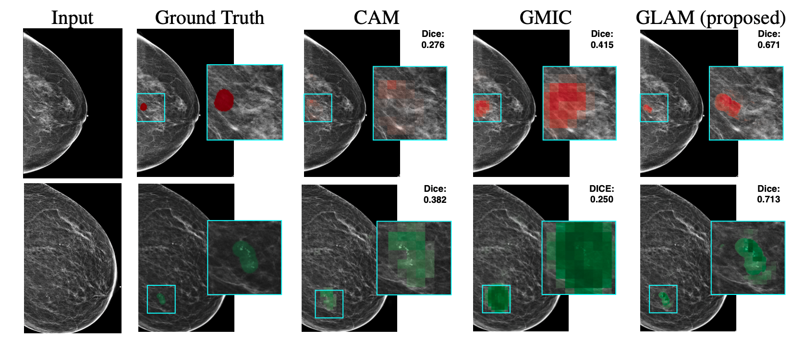

# Weakly-supervised High-resolution Segmentation of Mammography Images for Breast Cancer Diagnosis

## Introduction
This is an implementation of the GLAM (Global-Local Activation Maps) model as described in [our paper](https://openreview.net/pdf?id=nBT8eNF7aXr).  In this work, we introduce a novel neural network architecture to perform weakly-supervised segmentation of high-resolution images. The proposed model selects regions of interest via coarse-level localization, and then performs fine-grained segmentation of
those regions.
We apply this model to breast cancer diagnosis with screening mammography, and validate it on a large clinically-realistic dataset. Measured by Dice similarity score, our approach outperforms existing methods by a large margin in terms of localization performance of benign and malignant lesions, relatively improving the performance by 39.6\% and 20.0\%, respectively. 
The inference pipeline of the model is shown below.

<p align="center">
  
</p>

Highlights of GLAM:

- **Weakly-supervised High-resolution Segmentation**: Despite being trained with only image-level labels, GLAM is able to generate fine-grained pixel-level saliency maps (shown below) that provide interpretability for high-resolution images.

<p align="center">
  
</p>
We provide this implementation that allows users to use one of our pretrained models and to obtain predictions and saliency maps for breast cancer detection. The model is implemented in PyTorch. 

* Input: A mammography image that is cropped to 2944 x 1920 and is saved as 16-bit png file. Within this repository, we provide four sample exams (images are stored in `sample_data/images` directory and their corresponding exam list is stored in `sample_data/exam_list_before_cropping.pkl`). Each exam includes four images, corresponding to the  following views: L-CC, R-CC, L-MLO and R-MLO. These exams contain original mammography images and therefore need to be preprocessed (see the Preprocessing section). 

* Output: The GLAM model generates a set of predictions for each image, consisting of values indicating model's confidence in benignity and malignancy of the findings. Predictions are saved into a csv file `$OUTPUT_PATH/predictions.csv` that contains the following fields: image_index, benign_pred, malignant_pred, benign_label, malignant_label. In addition, each input image is associated with a visualization file saved under `$OUTPUT_PATH/visualization`. The images (from left to right) represent:
  * input mammography with ground truth annotation (green=benign, red=malignant) if there is a segmentation mask in the input,
  * patch map that illustrates the locations of selected patches (blue squares),
  * saliency map for benign class,
  * saliency map for malignant class,
  * selected patches.

The code in this repository is partially based on the implementation of [GMIC](https://github.com/nyukat/GMIC).

## Prerequisites

* Python (3.6)
* PyTorch (1.1.0)
* torchvision (0.2.2)
* NumPy (1.14.3)
* SciPy (1.0.0)
* H5py (2.7.1)
* imageio (2.4.1)
* pandas (0.22.0)
* opencv-python (3.4.2)
* tqdm (4.19.8)
* matplotlib (3.0.2)

## License

This repository is licensed under the terms of the GNU AGPLv3 license.

## How to run the code

One way to set up the environment is to use conda. With conda installed on your system, please run the following line to setup the environment: 
(Note that you need to first cd to the project directory)

`conda env create -f environment.yml` 

Once you have installed and activated all the dependencies, you can execute the following command to automatically run the entire pipeline:

    bash ./run.sh <INPUT_FOLDER> <OUTPUT_FOLDER> <MODEL_NAME> <DEVICE_TYPE> <GPU_NUMBER>
  
where the arguments represent:
* `INPUT_FOLDER` - Folder with all input files.
* `OUTPUT_FOLDER` - Folder, where visualization files and predictions will be saved.
* `MODEL_NAME` - Name of the model to use. Valid values include {`model_joint`, `model_sep`}, the former one is the joint-trained model, the latter one is the model that trained without joint training.
* `DEVICE_TYPE` - Either `gpu` or `cpu`.
* `GPU_NUMBER` - Which gpu to use, e.g. `0`, does not matter if `DEVICE_TYPE==cpu`, default: `0`.
   
Additionally, there are several parameters in `run.sh` that, most likely, will not need to be changed:
* `MODEL_PATH`: The path where the model weights are saved.
* `IMAGES_FOLDER`: The directory where images are saved, based on the `INPUT_FOLDER`.
* `INITIAL_EXAM_LIST_PATH`: Path to initial exam list pkl file.
* `CROPPED_IMAGE_FOLDER`: The directory where cropped mammograms are saved.
* `CROPPED_EXAM_LIST_PATH`: Path to exam list pkl file created by cropping.
* `SEG_FOLDER`: The directory where ground truth segmenations are saved.
* `FINAL_EXAM_LIST_PATH`: Path to final exam list pkl file created after choosing best centers.
* `NUM_PROCESSES`: Number of processes used for multiprocessing of inputs. Default: `10`.
* `RUN_TIME`: This function calculates current time, which will be used to define `OUTPUT_FINAL_FOLDER`.
* `OUTPUT_FINAL_FOLDER`: Subfolder of `OUTPUT_FOLDER`, named according to the current `RUN_TIME`.

The default command runs `model_sep` model on `cpu` with the sample data included in this repository. It can be run by either using the default values or by providing them explicitly:

    bash ./run.sh
    
or
    
    bash ./run.sh sample_data sample_output model_sep cpu

After running one of the above commands, you should obtain the outputs for the sample exams provided in the repository. They can be found in 
`sample_output/<current_time>/predictions.csv` by default). Note that the output scores are not calibrated. 

image_index  |  benign_pred  |  malignant_pred  |  benign_label  |  malignant_label
-------------|---------------|------------------|----------------|-----------------
0_L-CC       |  0.3141       |  0.0111          |  0             |  0
0_R-CC       |  0.4512       |  0.1458          |  1             |  0
0_L-MLO      |  0.3604       |  0.0723          |  0             |  0
0_R-MLO      |  0.4853       |  0.1042          |  1             |  0
1_L-CC       |  0.1149       |  0.0202          |  0             |  0
1_R-CC       |  0.3709       |  0.3190          |  0             |  1
1_L-MLO      |  0.1107       |  0.0233          |  0             |  0
1_R-MLO      |  0.3751       |  0.3492          |  0             |  1
2_L-CC       |  0.1720       |  0.0564          |  0             |  0
2_R-CC       |  0.3367       |  0.0516          |  1             |  0
2_L-MLO      |  0.1275       |  0.0196          |  0             |  0
2_R-MLO      |  0.3789       |  0.0724          |  1             |  0
3_L-CC       |  0.4849       |  0.3341          |  0             |  1
3_R-CC       |  0.3396       |  0.1092          |  0             |  0
3_L-MLO      |  0.4716       |  0.2484          |  0             |  1
3_R-MLO      |  0.2068       |  0.0445          |  0             |  0

You should also find the visualization of the saliency maps under `sample_output/<current_time>/visualization/`. 


TIP: If you'd like to run individual Python scripts, please include the path to this repository in your `PYTHONPATH`. 

## Data

`sample_data/images` contains 4 exams each of which includes 4 original mammography images (L-CC, L-MLO, R-CC, R-MLO). All mammography images are saved in png format. The original 12-bit mammograms are saved as rescaled 16-bit images to preserve the granularity of the pixel intensities, while still being correctly displayed in image viewers.

`sample_data/segmentation` contains the binary pixel-level segmentation labels for some exams. All segmentations are saved as png images.

`sample_data/exam_list_before_cropping.pkl` contains a list of exam information. Each exam is represented as a dictionary with the following format:

```python
{'horizontal_flip': 'NO',
  'L-CC': ['0_L-CC'],
  'L-MLO': ['0_L-MLO'],
  'R-MLO': ['0_R-MLO'],
  'R-CC': ['0_R-CC'],
  'cancer_label': {
    'benign': 1,
    'right_benign': 1, 
    'malignant': 0, 
    'left_benign': 0, 
    'unknown': 0, 
    'right_malignant': 0,
    'left_malignant': 0},
  'L-CC_benign_seg': ['0_L-CC_benign'],
  'L-CC_malignant_seg': ['0_L-CC_malignant'],
  'L-MLO_benign_seg': ['0_L-MLO_benign'],
  'L-MLO_malignant_seg': ['0_L-MLO_malignant'],
  'R-MLO_benign_seg': ['0_R-MLO_benign'],
  'R-MLO_malignant_seg': ['0_R-MLO_malignant'],
  'R-CC_benign_seg': ['0_R-CC_benign'],
  'R-CC_malignant_seg': ['0_R-CC_malignant']}
```
In their original formats, images from `L-CC` and `L-MLO` views face right, and images from `R-CC` and `R-MLO` views face left. We horizontally flipped `R-CC` and `R-MLO` images so that all four views face right. Values for `L-CC`, `R-CC`, `L-MLO`, and `R-MLO` are list of image filenames without extensions and directory name. Segmentation information is optional and, if provided, will be used in visualization.

### Preprocessing

Here, we will describe the preprocessing pipeline used in `run.sh`. The following commands crop mammograms and calculate information about augmentation windows.

#### Cropping mammograms
```bash
python3 src/cropping/crop_mammogram.py \
    --input-data-folder $IMAGES_FOLDER \
    --output-data-folder $CROPPED_IMAGE_FOLDER \
    --exam-list-path $INITIAL_EXAM_LIST_PATH  \
    --cropped-exam-list-path $CROPPED_EXAM_LIST_PATH  \
    --num-processes $NUM_PROCESSES
```
`src/cropping/crop_mammogram.py` crops the mammogram around the breast and discards the background in order to improve image loading time and time to run segmentation algorithm and saves each cropped image to `$CROPPED_IMAGE_FOLDER/<image_id>.png` using h5py. It also adds additional information for each image and creates a new image list to `$CROPPED_IMAGE_LIST_PATH` while discarding images which it fails to crop. 

Cropping adds below information to the exams in the pkl file:

```python
{'window_location':
 {'L-CC': [(0, 2023, 0, 801)],
 'R-CC': [(0, 2144, 0, 801)],
 'L-MLO': [(0, 2730, 0, 981)],
 'R-MLO': [(0, 2650, 0, 1006)]},
'rightmost_points': {'L-CC': [((948, 957), 750)], 
 'R-CC': [((1232, 1249), 751)],
 'L-MLO': [((1733, 1749), 930)], 
 'R-MLO': [((1571, 1648), 956)]}, 
'bottommost_points': {'L-CC': [(1972, (100, 100))], 
 'R-CC': [(2093, (101, 101))], 
 'L-MLO': [(2679, (100, 101))],
 'R-MLO': [(2599, (101, 102))]}, 
'distance_from_starting_side': {'L-CC': [0], 
 'R-CC': [0],
 'L-MLO': [0], 
 'R-MLO': [0]}
}
```
  
  <!--- Optional --verbose argument prints out information about each image. The additional information includes the following:
- `window_location`: location of cropping window w.r.t. original dicom image so that segmentation map can be cropped in the same way for training.
- `rightmost_points`: rightmost nonzero pixels after correctly being flipped.
- `bottommost_points`: bottommost nonzero pixels after correctly being flipped.
- `distance_from_starting_side`: records if zero-value gap between the edge of the image and the breast is found in the side where the breast starts to appear and thus should have been no gap. Depending on the dataset, this value can be used to determine wrong value of `horizontal_flip`.-->


#### Calculating optimal centers
```bash
python3 src/optimal_centers/get_optimal_centers.py \
    --cropped-exam-list-path $CROPPED_EXAM_LIST_PATH \
    --data-prefix $CROPPED_IMAGE_FOLDER \
    --output-exam-list-path $FINAL_EXAM_LIST_PATH \
    --num-processes $NUM_PROCESSES
```
`src/optimal_centers/get_optimal_centers.py` outputs new exam list with additional metadata to `$FINAL_EXAM_LIST_PATH`. The additional information is `best_center` - optimal center point of the window for each image. The augmentation windows drawn with `best_center` as exact center point could go outside the boundary of the image. This usually happens when the cropped image is smaller than the window size. In this case, we pad the image and shift the window to be inside the padded image in augmentation. Refer to [the data report](https://cs.nyu.edu/~kgeras/reports/datav1.0.pdf) for more details. Example of `best_center` info:

```python
{'best_center':
 {'L-CC': [(1011, -211)],
 'R-CC': [(1072, -210)],
 'L-MLO': [(1206, -31)],
 'R-MLO': [(1126, -5)]}
}
```

#### Outcomes of preprocessing
After the preprocessing step, you should have the following files in the `$INPUT_FOLDER` directory:
- cropped_images: a folder that contains the cropped images corresponding to all images in the `$INPUT_FOLDER/images`.
- data.pkl: the final pickle file of a data list that includes the preprocessing metadata for each image and exam.

### Inference with classifier
Inference is run by the following command:
```bash
python3 src/scripts/run_model.py \
    --model-path "${MODEL_PATH}" \
    --data-path "${FINAL_EXAM_LIST_PATH}" \
    --image-path "${CROPPED_IMAGE_FOLDER}" \
    --segmentation-path "${SEG_FOLDER}" \
    --output-path "${OUTPUT_FINAL_FOLDER}" \
    --device-type "${DEVICE_TYPE}" \
    --gpu-number "${GPU_NUMBER}" \
    --model-index "${MODEL_NAME}" \
    --visualization-flag
```

It creates predictions of GLAM in `$OUTPUT_FOLDER/<current_time>` folder. In addition, it generates visualization of outputs.

### Adding your own dataset

To evaluate GLAM on your own dataset, you need to provide a folder consisting of the following data:
- A folder named `images/` containing all images.
- (optional) A folder named `segmentation/` containing segmentations of chosen images.
- A pkl file `exam_list_before_cropping.pkl` containing information about images, as in the Data section.


## Reference

If you found this code useful, please cite our paper:

**Weakly-supervised High-resolution Segmentation of Mammography Images for Breast Cancer Diagnosis**\
Kangning Liu, Yiqiu Shen, Nan Wu, Jakub Chledowski, Carlos Fernandez-Granda, and Krzysztof J. Geras.  
Medical Imaging with Deep Learning
(2021).
    
    @inproceedings{liu2021weakly,
      title={Weakly-supervised High-resolution Segmentation of Mammography Images for Breast Cancer Diagnosis},
      author={Liu, Kangning and Shen, Yiqiu and Wu, Nan and Chledowski, Jakub and Fernandez-Granda, Carlos and Geras, Krzysztof J},
      booktitle={Medical Imaging with Deep Learning},
      year={2021}
    }
